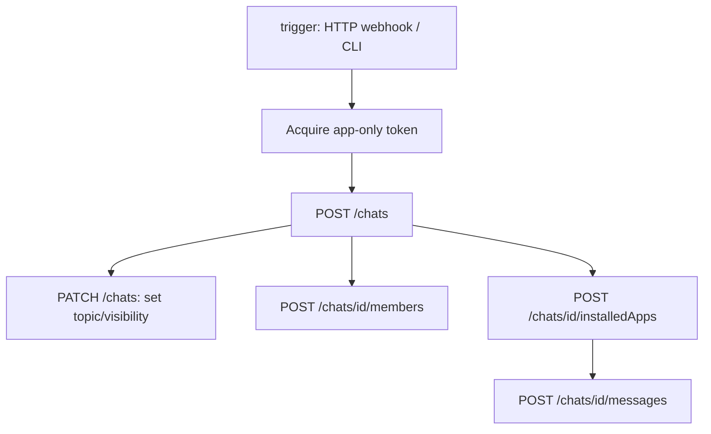

# demo-war-room-teams-chat
Demo application to demonstrate war-room chat creation on MS Teams

## Contents

- [demo-war-room-teams-chat](#demo-war-room-teams-chat)
  - [Contents](#contents)
  - [War‑Room Bot – Implementation Definition Guide](#warroom-bot--implementation-definition-guide)
    - [1  Overview](#1overview)
    - [2  Prerequisites](#2prerequisites)
    - [3  High‑level Architecture](#3highlevel-architecture)
    - [4  Feature‑by‑Feature Plan (Copilot‑first)](#4featurebyfeature-plan-copilotfirst)
      - [4.1 Input arguments](#41-input-arguments)
    - [5  Development Workflow in VS Code (Copilot Business)](#5development-workflow-in-vscode-copilotbusiness)
    - [6  Security Controls](#6security-controls)
    - [7  Testing Strategy](#7testing-strategy)
    - [8  Deployment](#8deployment)
    - [9  Next Steps](#9next-steps)

## War‑Room Bot – Implementation Definition Guide

*Target stack*: **Python 3.x**, **MSAL**, **Microsoft Graph REST**

*IDE*: **VS Code** with **GitHub Copilot Business**

---

### 1  Overview

Automate the creation of an incident “war‑room” chat, invite responders, install the bot, and post an initial message – all from a head‑less service account.

### 2  Prerequisites

1. Microsoft Entra ID app registration with these *application* scopes
   - `Chat.Create`
     - Allows the app to create chats without a signed-in user.
     - https://learn.microsoft.com/en-us/graph/api/chat-post?view=graph-rest-1.0&tabs=http
     - https://learn.microsoft.com/en-us/graph/permissions-reference#chatcreate
     - Create a group chat: https://learn.microsoft.com/en-us/graph/api/chat-post?view=graph-rest-1.0&tabs=http#example-2-create-a-group-chat
   - `ChatMember.ReadWrite.All`
      - Add and remove members from all chats, without a signed-in user.
      - https://learn.microsoft.com/en-us/graph/permissions-reference#chatmemberreadwriteall
      - https://learn.microsoft.com/en-us/graph/api/chat-get-members?view=graph-rest-1.0&tabs=http
   - `TeamsAppInstallation.ReadWriteForChat.All`
     - Allows the app to read, install, upgrade, and uninstall Teams apps in any chat, without a signed-in user. Does not give the ability to read application-specific settings.
     - https://learn.microsoft.com/en-us/graph/api/chat-teamsappinstallation-upgrade?view=graph-rest-1.0&tabs=http
     - https://learn.microsoft.com/en-us/graph/api/chat-get-installedapps?view=graph-rest-1.0&tabs=http
   - `User.ReadBasic.All`
     - Allows the app to read a basic set of profile properties of other users in your organization without a signed-in user. Includes display name, first and last name, email address, open extensions, and photo.
     - displayName, givenName, id, mail, photo, securityIdentifier, surname, userPrincipalName
     - https://learn.microsoft.com/en-us/graph/permissions-reference#userreadbasicall
2. The bot’s Teams App ID (for RSC) packaged and published in the tenant app catalog.
3. VS Code extensions: *Python*, *GitHub Copilot*, *REST Client* (optional for Graph testing).
4. Environment variables for `CLIENT_ID`, `TENANT_ID`, `CLIENT_SECRET`.

### 3  High‑level Architecture

### 4  Feature‑by‑Feature Plan (Copilot‑first)

| # | Feature                                    | Copilot Prompt                                                                                                                                       | Acceptance Criteria                                                              |
| - | ------------------------------------------ | ---------------------------------------------------------------------------------------------------------------------------------------------------- | -------------------------------------------------------------------------------- |
| 1 | **Token acquisition** (client‑credentials) | *"Write a Python async function that fetches an app‑only token for Microsoft Graph using MSAL ConfidentialClientApplication. Return access\_token."* | Function returns non‑empty JWT; renews before expire;  ‑‑ unit test mocks MSAL.  |
| 2 | **Create chat**                            | *"Given a list of Azure AD objectIds, generate code to call POST /chats with chatType='group' and return chatId."*                                   | HTTP 201; response contains `id`; retry on 429.                                  |
| 3 | **Add members**                            | *"Add users to an existing chat via POST /chats/{chatId}/members. Use role='owner' for the first member."*                                           | All members appear in GET /chats/{id}/members; owner verified.                   |
| 4 | **Install bot & request RSC**              | *"Install our Teams app into a chat with appId=\<APP\_ID> and request ChatMessage.Send.Chat permission set."*                                        | GET /installedApps shows status `installed`; calling messages endpoint succeeds. |
| 5 | **Send initial message**                   | *"Post a Markdown welcome message with @mentions using POST /chats/{id}/messages."*                                                                  | Message visible in Teams UI; mentions resolve.                                   |
| 6 | **Idempotency**                            | *"Add a decorator that skips create steps if chat already exists with same topic."*                                                                  | Re‑running script doesn’t duplicate rooms.                                       |
| 7 | **Logging & telemetry**                    | *"Integrate structured logging with loguru; emit Graph call latency and response codes."*                                                            | Log file lines contain ISO timestamps, event name, latency.                      |
| 8 | **Error handling**                         | *"Generate an exception hierarchy mapping Graph 4xx/5xx to custom errors; implement exponential backoff."*                                           | Script exits with non‑zero on fatal; retries capped at 3.                        |

#### 4.1 Input arguments

- config (yaml) file, like: "config/config.yaml"
- logging directory, like: "logs"
- chat room name, like: "TEST-WAR-ROOM SIXXXXXX"
- chat room initial message, like: "Hi, this war-room is automatically created."
- chat room participant email address list, like: "x.y@z.com, a.b@c.org, e.f@z.com"

### 5  Development Workflow in VS Code (Copilot Business)

1. **Bootstrap project** – open empty folder, run `python -m venv .venv` → *Copilot suggests* requirements section.
2. **Feature‑branch per row** from table → let Copilot scaffold the function, then add tests.
3. **Inline suggestions** – use `⌥ \` to cycle; accept with `Tab`.
4. **Copilot chat** – ask “*Explain why my POST returns 403*” to debug permissions quickly.
5. **Code reviews** – enable Copilot PR summaries so reviewers see generated logic context.

### 6  Security Controls

- Store secret in a yaml config file; fetch at runtime.
- Conditional Access policy: restrict service principal to trusted IPs.
- Rotate client secret after test, configure shor expire date, like 30 days for a test.

### 7  Testing Strategy

- Test with at least, 3 email addresses defined in cli.
- Unit tests with `pytest` + `responses` to stub Graph API.
- Clean up chats after run, always include tester.

### 8  Deployment

To be discussed later.

### 9  Next Steps

To be discussed later.